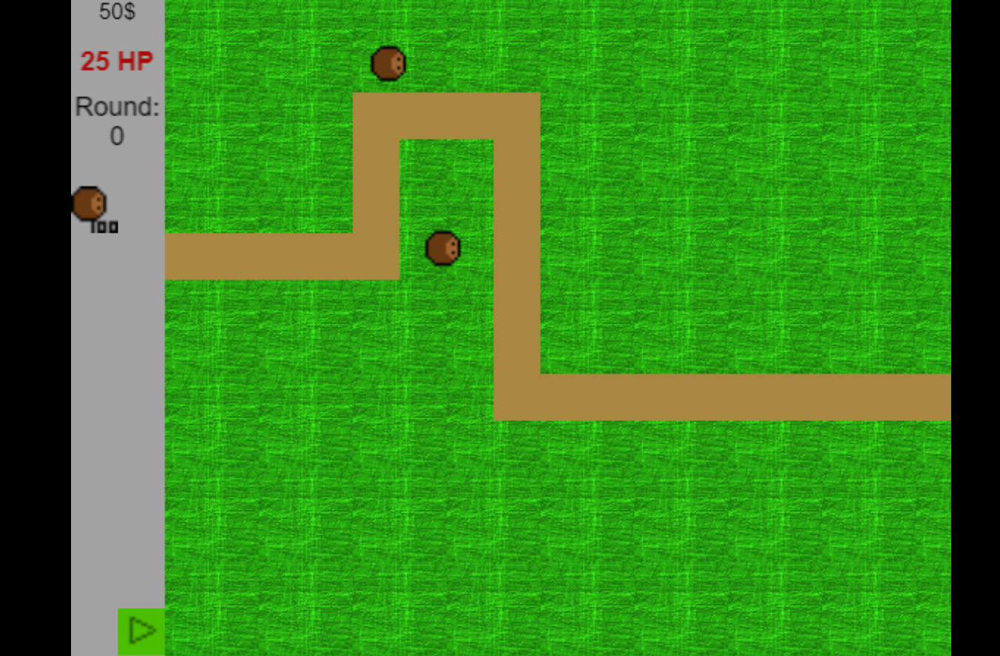

# Bloons-on-Gdevelop
Bloons on Gdevelop
## Link to Game
[https://bearofbusines.me/Bloons-on-Gdevelop/](https://bearofbusines.github.io/Bloons-on-Gdevelop/)
 
## Images
 

 
 
# How to play 
 
There are two modes easy and hard the former has 25 lives and the latter has 1 life.
 
 
You have to place towers to pop the bloons you press and release the left mouse button and then click on the spawned dart monkey and drag it to the location where you want it.
 
 
when you pop bloons you gain money to spend on more monkies.
